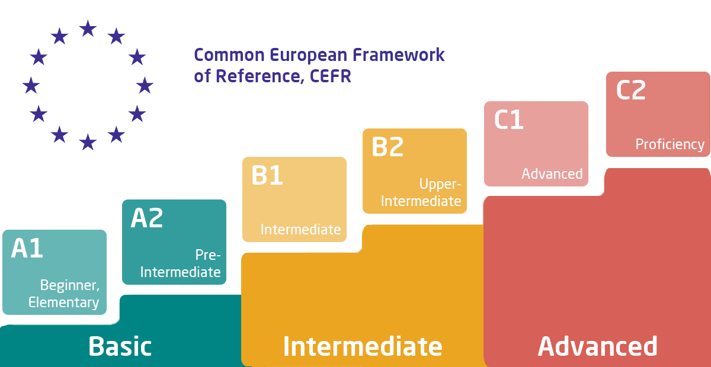

# Front-End Trainee roadmap

## Inspired from

- https://github.com/kamranahmedse/developer-roadmap
- https://roadmap.sh/frontend
- https://roadmap.sh/angular
- https://roadmap.sh/react

## Table of Content

- [Prerequisites](#Prerequisites)
- [How does the browser render a website](#how-does-the-browser-render-a-website)
- [HTTP](#HTTP)
- [HTML](#HTML)
- [CSS](#CSS)
- [JavaScript](#JavaScript)
- [TypeScript](#TypeScript)
- [Build Tools](#Build-Tools)
- [Angular](#Angular)
- [React](#React)
- [Git](#git)
- [Soft skills](#Soft-skills)
- [Youtube channels to subscribe](#Youtube-channels-to-subscribe)

## Prerequisites

`English`

- Minimal level: B1
- Comfortable level: B2

## How does the browser render a website

https://www.youtube.com/watch?v=hJHvdBlSxug&ab_channel=Academind

https://www.youtube.com/watch?v=SmE4OwHztCc&ab_channel=JSConf

---

## HTTP

https://www.youtube.com/watch?v=iYM2zFP3Zn0&t=442s&ab_channel=TraversyMedia

https://www.youtube.com/watch?v=2JYT5f2isg4&ab_channel=freeCodeCamp.org

https://www.youtube.com/watch?v=ZKEqqIO7n-k&ab_channel=WebDevSimplified

`CORS`

https://www.youtube.com/watch?v=PNtFSVU-YTI&ab_channel=WebDevSimplified

---

## HTML

https://www.youtube.com/watch?v=DPnqb74Smug&ab_channel=freeCodeCamp.org

https://www.youtube.com/watch?v=N8YMl4Ezp4g&ab_channel=Codevolution

https://www.youtube.com/playlist?list=PL41lfR-6DnOq3BebucTNMSVDojCIiv_en

---

## CSS

https://www.youtube.com/watch?v=0W6qz0-aDaM&list=PL0Zuz27SZ-6Mx9fd9elt80G1bPcySmWit&ab_channel=DaveGray

https://www.youtube.com/watch?v=1Rs2ND1ryYc&ab_channel=freeCodeCamp.org

https://www.youtube.com/watch?v=MNPdifWAAa4&ab_channel=DaveGray

https://www.youtube.com/watch?v=YszONjKpgg4&list=PLZlA0Gpn_vH8mpXIUHjWoMAAgoCEinL0R

`HTML&CSS: Interactive Courses`

[Freeversity: HTML&CSS Full Course](https://freeveristy.github.io/courses/1)

`Responsive Web Design Tutorials`

https://www.youtube.com/watch?v=srvUrASNj0s&ab_channel=freeCodeCamp.org

https://www.youtube.com/playlist?list=PL4cUxeGkcC9g9Vh9MAA-XKnfJsWZnPZFw

`CSS Positioning Tutorials`

https://www.youtube.com/playlist?list=PL4cUxeGkcC9hudKGi5o5UiWuTAGbxiLTh

`SCSS`

https://www.youtube.com/watch?v=_kqN4hl9bGc&list=PL4cUxeGkcC9jxJX7vojNVK-o8ubDZEcNb&ab_channel=TheNetNinja

`flexbox`

https://www.youtube.com/watch?v=3YW65K6LcIA&ab_channel=TraversyMedia

`tailwind`

https://www.youtube.com/playlist?list=PL4cUxeGkcC9gpXORlEHjc5bgnIi5HEGhw

https://www.youtube.com/watch?v=lZp4salRFFc&ab_channel=DailyTuition

`bulma`

https://www.youtube.com/playlist?list=PL4cUxeGkcC9iXItWKbaQxcyDT1u6E7a8a

`bootstrap`

https://www.youtube.com/playlist?list=PL4cUxeGkcC9joIM91nLzd_qaH_AimmdAR

---

## JavaScript

https://www.youtube.com/watch?v=hdI2bqOjy3c&ab_channel=TraversyMedia

https://www.youtube.com/watch?v=zBPeGR48_vE&list=PLqkLaKB2GJhWXV9rcarwvn06ISlL_9mPQ&ab_channel=CoderLipi

https://www.youtube.com/playlist?list=PLDyQo7g0_nsX8_gZAB8KD1lL4j4halQBJ

`Object Oriented JavaScript`

https://www.youtube.com/playlist?list=PL4cUxeGkcC9i5yvDkJgt60vNVWffpblB7

`Callbacks, Promises, Async Await`

https://www.youtube.com/watch?v=PoRJizFvM7s&ab_channel=TraversyMedia

https://www.youtube.com/playlist?list=PL4cUxeGkcC9jx2TTZk3IGWKSbtugYdrlu

`Modular Javascript`

https://www.youtube.com/playlist?list=PLoYCgNOIyGABs-wDaaxChu82q_xQgUb4f

`Event loop`

https://towardsdev.com/event-loop-in-javascript-672c07618dc9

https://www.youtube.com/watch?v=8aGhZQkoFbQ&ab_channel=JSConf

`JavaScript Best Practices and Coding Conventions`

https://www.youtube.com/watch?v=RMN_bkZ1KM0&ab_channel=JavaScriptMastery

https://www.youtube.com/playlist?list=PLY5pAT_51eGyo4ixvdZgzY57N0_R1QMtb

https://www.youtube.com/playlist?list=PLZlA0Gpn_vH_CthENcPCM0Dww6a5XYC7f

https://www.youtube.com/playlist?list=PLFKDYTlP3abzwWleHq1WHcKyi8nCPY74s

---

## TypeScript

https://www.youtube.com/playlist?list=PL4cUxeGkcC9gUgr39Q_yD6v-bSyMwKPUI

https://www.youtube.com/watch?v=d56mG7DezGs&ab_channel=ProgrammingwithMosh

https://www.youtube.com/playlist?list=PLqq-6Pq4lTTanfgsbnFzfWUhhAz3tIezU

https://www.youtube.com/playlist?list=PLYvdvJlnTOjF6aJsWWAt7kZRJvzw-en8B

https://www.youtube.com/watch?v=jBmrduvKl5w&list=PLZlA0Gpn_vH_z2fqIg50_POJrUkJgBu7g

`TypeScript Design Patterns`

https://www.youtube.com/playlist?list=PLzvRQMJ9HDiSk1pnrKewLklYfCdu9Qjhy

---

## Build Tools

`npm`

https://www.youtube.com/playlist?list=PLC3y8-rFHvwhgWwm5J3KqzX47n7dwWNrq

`yarn`

https://www.youtube.com/watch?v=ByRxp9VlzeI&ab_channel=WebStylePress

`webpack`

https://www.youtube.com/playlist?list=PLB67cosR0_lPUXIK35J8M7EQUbUJQMA0Q

---

## Angular

Big framework better to start learning from official documentation

https://angular.io/

`basic`

https://www.youtube.com/playlist?list=PLC3y8-rFHvwhBRAgFinJR8KHIrCdTkZcZ

`angular material`

https://www.youtube.com/playlist?list=PLC3y8-rFHvwilEuCqFGTL5Gt5U6deIrsU

`ngrx`

https://www.youtube.com/playlist?list=PLW2eQOsUPlWJRfWGOi9gZdc3rE4Fke0Wv

`rxjs`

https://www.youtube.com/playlist?list=PLX7eV3JL9sfl8lRNZyzAu8YN-uqrgbhij

https://www.youtube.com/playlist?list=PL55RiY5tL51pHpagYcrN9ubNLVXF8rGVi

`angular forms`

https://www.youtube.com/playlist?list=PLzAGFfNxKFubQOdaJK3evoEKFuD-nAnkL

`Component Interaction`

https://www.youtube.com/playlist?list=PLC3y8-rFHvwgKhaLU8GTyF-5Bb8qT-wzV

`SOLID`

https://www.youtube.com/watch?v=Y-MRJ9QYCvI&t=672s&ab_channel=DecodedFrontend

---

## React

Big framework better to start learning from official documentation

https://reactjs.org/docs/getting-started.html

`render`

https://www.youtube.com/playlist?list=PLC3y8-rFHvwg7czgqpQIBEAHn8D6l530t

`react + typescript`

https://www.youtube.com/playlist?list=PLC3y8-rFHvwi1AXijGTKM0BKtHzVC-LSK

`How to Style your React App`

https://www.youtube.com/watch?v=DXikBH-LCF4&ab_channel=EricMurphy

`React Material UI`

https://www.youtube.com/playlist?list=PLC3y8-rFHvwh-K9mDlrrcDywl7CeVL2rO

`react context & hooks`

https://www.youtube.com/playlist?list=PL4cUxeGkcC9hNokByJilPg5g9m2APUePI

https://www.youtube.com/watch?v=cF2lQ_gZeA8&list=PLC3y8-rFHvwisvxhZ135pogtX7_Oe3Q3A

https://www.youtube.com/watch?v=O6P86uwfdR0&list=PLZlA0Gpn_vH8EtggFGERCwMY5u5hOjf-h

`formik`

https://www.youtube.com/playlist?list=PLC3y8-rFHvwiPmFbtzEWjESkqBVDbdgGu

`react-hook-form`

https://www.youtube.com/playlist?list=PL03g4H_exuTppOgtY-45oWvN79rvJIKzf

`react query`

https://www.youtube.com/playlist?list=PLC3y8-rFHvwjTELCrPrcZlo6blLBUspd2

`react testing library`

https://www.youtube.com/playlist?list=PL4cUxeGkcC9gm4_-5UsNmLqMosM-dzuvQ

`React SOLID Principles`

https://www.youtube.com/watch?v=MSq_DCRxOxw&ab_channel=CoderOne

`React Design Patterns`

https://www.youtube.com/playlist?list=PLgeETUaEEds5HE2uGWezJxYeZwpBonHr-

`React Storybook Tutorial`

https://www.youtube.com/watch?v=BySFuXgG-ow&list=PLC3y8-rFHvwhC-j3x3t9la8-GQJGViDQk

---

## Git

https://www.youtube.com/watch?v=USjZcfj8yxE&ab_channel=ColtSteele

https://www.youtube.com/watch?v=8JJ101D3knE&ab_channel=ProgrammingwithMosh

https://www.youtube.com/watch?v=Uszj_k0DGsg&ab_channel=freeCodeCamp.org

https://www.youtube.com/watch?v=wIY824wWpu4&ab_channel=Ihatetomatoes

https://www.youtube.com/watch?v=CRlGDDprdOQ&ab_channel=Academind

---

## Soft skills

https://www.youtube.com/watch?v=ll7JyRxWMQY&ab_channel=KnowledgeHutupGrad

https://www.youtube.com/@skillopedia/featured

---

## Newsletters

https://bytes.dev/

https://react.libhunt.com/

https://react.statuscode.com/

https://javascriptweekly.com/

https://tailwindweekly.com/

https://medium.com/

## Youtube channels to subscribe

https://www.youtube.com/@WebDevSimplified

https://www.youtube.com/@DecodedFrontend

https://www.youtube.com/@CodeShotsWithProfanis

https://www.youtube.com/@NetNinja

https://www.youtube.com/@JoshuaMorony

https://www.youtube.com/@DreyLikyDev

https://www.youtube.com/@Codevolution

https://www.youtube.com/@CoderOne
